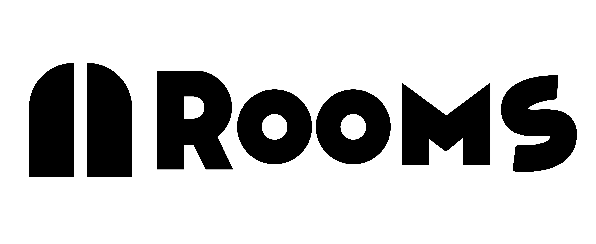

# 11 ROOMS

Harnessing the power of the HTML Canvas, 11 ROOMS is a simple, geometric game in which a player navigates through a series of - who would've guessed it? - eleven rectangular rooms. Besides the logo, every graphic in 11 ROOMS is created natively with HTML canvas functions (rect, arc, etc.), showcasing just how powerful such tools are when it comes to minimalistic game design.

